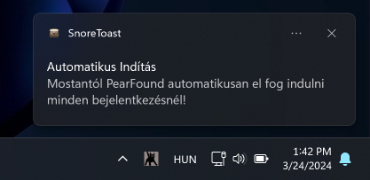
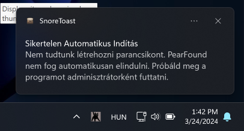

# PearFound


-red?logo=macos&link=https%3A%2F%2Fgithub.com%2Fcablesalty%2FPearFound%2Freleases%2F)

### Kapj értesítést ha Pearoo élő adást indít!


# Funkciók
- Kompatibilítás macOS-el és Windows-al
- Gyors csatorna megnyitás
- Értesítések némítása
- Egyedi stream értesítőablak
- Automatikus indítás bejelentkezéskor/gépindításkor (beta)
- Új verzió ellenőrzés
- Demo mód
- Rejtett - Nincs felesleges nyitott ablak
- **100% Pearoo Certified**

### És így néz ki, ha értesítést kapsz


# Telepítés
Használd [a telepítőt](https://github.com/cablesalty/PearFound/releases/). **PearFound jelenleg kompatibilis macOS-el és Windows-al.**

# Első indítás (fontos)
Ahhoz, hogy a PearFound minden bejelentkezéskor/gépindításkor elinduljon, **a telepítés után adminisztrátorként kell futtatnod a programot.**

Ez csak ideiglenesen lesz így, amíg nem találok egy megoldást arra, hogy a program magátol kérjen adminisztrátori jogokat.

**Ha mindent jól csinálsz, ennek kell megjelennie futtatáskor:**
  
*(Példa egy sikeres első futtatásra)*

**Viszont, ha nem adminként futtatod, ezt az üzenetet kapod:**
  
*(Példa egy sikertelen első futtatásra)*

Ez az értesítés minden indításkor meg fog jelenni addig, ameddig nem futtatod adminisztrátorként.

# Manuális telepítés
Ha nem szeretnéd használni a prebuilt telepítőt.
## 1. Cloneold le a repository-t
```
git clone https://github.com/cablesalty/pearfound
cd pearfound
```
*(szükséges: [Git CLI](https://git-scm.com/downloads))*
### Vagy [töltsd le a .zip fájlt](https://github.com/cablesalty/PearFound/archive/refs/heads/main.zip)
## 2. Node dependency-k telepítése
A a lecloneolt mappában:
```
npm init -y
npm install
```
*(szükséges: [Node.JS](https://nodejs.org/))*
## 3. Program futtatása
```
npm run start
```
*(szükséges: [Node.JS](https://nodejs.org/))*

**Fontos:** Ha nem buildeled le az appot, akkor nem fog automatikusan elindulni minden bejelentkezésnél.

## 4. Buildelés (opcionális)
Ha minden jól ment a manuális telepítés során, és szeretnél egy telepítőfájlt a kódbol akkor futtasd ezt a parancsot:
```
npm run make
```
*(szükséges: [Node.JS](https://nodejs.org/))*

Ezáltal kapni fogsz 3 buildet az `out/make` mappában.

### Ezután, a program elindul pont úgy, mintha [a telepítőt](https://github.com/cablesalty/PearFound/releases/) használtad volna.


# Credits
- **Nezushai**: Hangja benne van a sound effektbe. [Itt a klip amiből kivettem a hangját (kurva jó)](https://www.youtube.com/clip/Ugkxrou0SH8AUwXfXp1OoA6gBjn0KwGQLiRI)

- **Bogeta11040 YouTube élő adás checkere**: Hála [ennek a reponak](https://github.com/bogeta11040/if-youtube-channel-live) nem kellett szenvednem a google (fos) API kulcsaival

- **Baarbaracrr**: Háttéranimáció. [CodePenről ~~lopott~~ kód](https://codepen.io/baarbaracrr/pen/KKovmGb)
