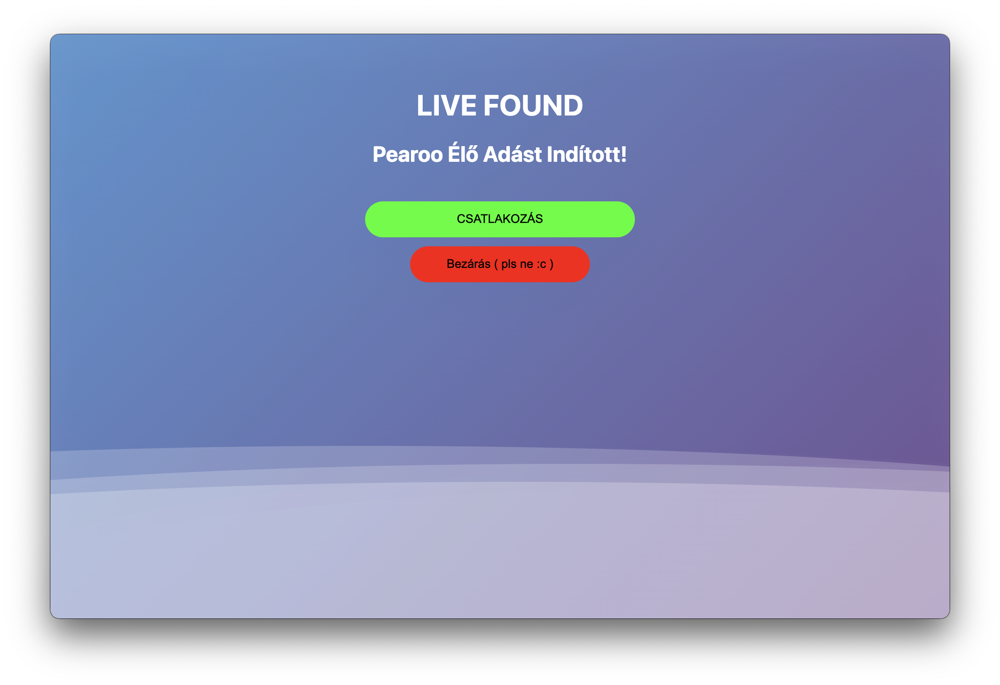

# PearFound
### Kapj értesítést ha Pearoo élő adást indít!


# Telepítés
Használd [a telepítőt](https://github.com/cablesalty/PearFound/releases/). PearFound jelenleg **kompatibilis macOS-el és Windows-al.**

# Manuális telepítés
Ha nem szeretnéd használni a prebuilt telepítőt.
## 1. Cloneold le a repository-t
```
git clone https://github.com/cablesalty/pearfound
cd pearfound
```
*(szükséges: [Git CLI](https://git-scm.com/downloads))*
### Vagy [töltsd le a .zip fájlt](https://github.com/cablesalty/PearFound/archive/refs/heads/main.zip)
## 2. Node dependency-k telepítése
A a lecloneolt mappában:
```
npm init -y
npm install
```
*(szükséges: [Node.JS](https://nodejs.org/))*
## 3. Program futtatása
```
npm run start
```
*(szükséges: [Node.JS](https://nodejs.org/))*

## 4. Buildelés (opcionális)
Ha minden jól ment a manuális telepítés során, és szeretnél egy telepítőfájlt a kódbol akkor futtasd ezt a parancsot:
```
npm run make
```
*(szükséges: [Node.JS](https://nodejs.org/))*

Ezáltal kapni fogsz 3 buildet az `out/make` mappában.

### Ezután, a program elindul pont úgy, mintha [a telepítőt](https://github.com/cablesalty/PearFound/releases/) használtad volna.


# Credits
- **Nezushai**: Hangja benne van a sound effektbe. [Itt a klip amiből kivettem a hangját (kurva jó)](https://www.youtube.com/clip/Ugkxrou0SH8AUwXfXp1OoA6gBjn0KwGQLiRI)

- **Bogeta11040 YouTube élő adás checkere**: Hála [ennek a reponak](https://github.com/bogeta11040/if-youtube-channel-live) nem kellett szenvednem a google (fos) API kulcsaival

- Baarbaracrr: Háttéranimáció. [CodePenről ~~lopott~~ kód](https://codepen.io/baarbaracrr/pen/KKovmGb)
